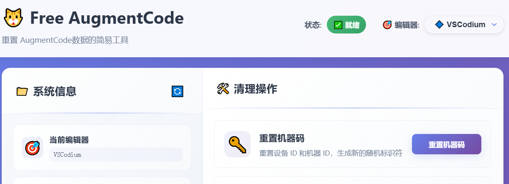

# Augment-Code-Free

**Português** | [English](README_EN.md)

[](https://github.com/vagmr/Augment-Code-free/releases)

Augment-Code-Free é uma ferramenta GUI simples para limpar dados relacionados ao plugin AugmentCode, evitando que sua conta seja desabilitada e permitindo que você desfrute gratuitamente do AugmentCode.

- **Detecção Automática** - Detecta com um clique todos os IDEs suportados instalados no sistema
- **Suporte Multiplataforma** - Compatível com Windows, macOS e Linux
- **Adaptação Dinâmica** - Ajusta automaticamente as operações disponíveis de acordo com o tipo de IDE selecionado

## Prévia da Interface

<div align="center">

### Tela Principal


### Tela de Operações


</div>

## Características

- 🖥️ **Interface GUI Moderna**
  - Aplicação desktop baseada em webview
  - Design de interface intuitivo
  - Feedback de operação em tempo real

- 🔍 **Detecção Inteligente de IDE**
  - Detecta automaticamente IDEs instalados no sistema
  - Suporte para série VSCode e série JetBrains
  - Compatível com múltiplas plataformas (Windows, macOS, Linux)
  - Adaptação dinâmica da interface de operações

- 💙 **Suporte para Série VSCode (vscode, vscodium, cursor, etc.)**
  - Redefine Device ID e Machine ID (Telemetry)
  - Limpa registros específicos no banco de dados SQLite
  - Limpa arquivos de armazenamento do workspace
  - Backup automático de dados originais

- 🧠 **Suporte para Série JetBrains (idea, pycharm, goland, etc.)**
  - Redefine PermanentDeviceId e PermanentUserId
  - Bloqueio automático de arquivos para evitar regeneração
  - Gerenciamento de permissões de arquivos multiplataforma
  - Suporte para todos os IDEs JetBrains principais

- 🛡️ **Recursos de Segurança**
  - Backup automático de arquivos importantes antes das operações
  - Mecanismo de bloqueio de arquivos para evitar modificações acidentais
  - Logs detalhados de operação e feedback de resultados


## Instruções de Instalação

### Método 1: Download Direto do Executável (recomendado para Windows)

1. Baixe a versão mais recente da página [Releases](https://github.com/vagmr/Augment-free/releases)
2. Extraia e execute `AugmentFree_latest.exe`

### Método 2: Executar a partir do Código Fonte

1. Certifique-se de que seu sistema tenha uma versão Python adequada instalada
2. Clone este repositório para local:
   ```bash
   git clone https://github.com/vagmr/Augment-free.git
   cd Augment-free
   ```
3. Instale as dependências:
   ```bash
   # Usando uv (recomendado)
   uv sync

   # Ou usando pip
   pip install -e .
   ```

## Como Usar

### Usando o Executável

1. **Saia da conta existente no plugin Augment**
2. **Feche completamente o editor selecionado**
3. **Execute o aplicativo**:
   - Clique duas vezes em `AugmentFree_latest.exe`
   - Ou execute no terminal: `./AugmentFree_latest.exe`
4. **Selecione as operações necessárias na interface GUI**
5. **Reinicie o editor selecionado**
6. **Use um novo email para fazer login no plugin Augment**

### Executando a partir do Código Fonte

1. **Saia da conta existente no plugin Augment**
2. **Feche completamente o editor selecionado**
3. **Execute o aplicativo**:
   ```bash
   # Usando o script run.py (recomendado)
   python run.py

   # Ou executando o módulo diretamente
   python -m augment_free.main
   ```
4. **Selecione as operações necessárias na interface GUI**
5. **Reinicie o editor selecionado**
6. **Use um novo email para fazer login no plugin Augment**


### Configuração do Ambiente de Desenvolvimento

1. Faça fork deste repositório
2. Clone seu fork:
   ```bash
   git clone https://github.com/seu-usuario-github/Augment-free.git
   ```
3. Instale as dependências de desenvolvimento:
   ```bash
   uv sync --dev
   ```
4. Faça suas modificações

## ⚠️ Aviso Legal

**Uso por Conta e Risco:** Esta ferramenta é fornecida apenas para fins educacionais e de pesquisa. O usuário assume total responsabilidade pelos riscos de uso.

**Segurança de Dados:** Certifique-se de fazer backup de dados importantes antes de usar. O autor não se responsabiliza por qualquer perda de dados.

**Uso Conforme:** Observe os termos de uso do software relevante e as leis locais.

**Sem Garantias:** Este software é fornecido "como está", sem qualquer garantia explícita ou implícita.

**Uso Comercial:** Todas as vendas comerciais são independentes do autor.

## Licença

Este projeto está licenciado sob a Licença MIT. Veja o arquivo [LICENSE](LICENSE) para detalhes.