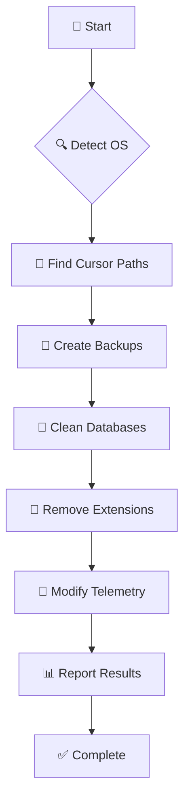

<div align="center">

# 🚀 Augment VIP

<p align="center">
  
  
  
  
</p>

<p align="center">
  <strong>🎯 A powerful toolkit for managing Cursor settings, databases, and extensions</strong>
</p>

<p align="center">
  Clean databases • Remove extensions • Modify telemetry • Cross-platform support
</p>

---

</div>

## ✨ Features

<table>
<tr>
<td width="50%">

### 🗄️ **Database Management**
- 🧹 Remove Augment-related entries
- 💾 Automatic backup creation
- 🔍 Smart detection of database files
- ⚡ Fast SQLite operations

</td>
<td width="50%">

### 🧩 **Extension Management**
- 🗑️ Complete extension removal
- 📁 Directory cleanup
- 🔒 Permission handling
- 📊 Detailed progress reporting

</td>
</tr>
<tr>
<td width="50%">

### 🔐 **Privacy & Security**
- 🎲 Random telemetry ID generation
- 🛡️ Safe backup operations
- 🔄 Rollback capabilities
- 🚫 No data collection

</td>
<td width="50%">

### 🌍 **Cross-Platform**
- 🪟 Windows support
- 🍎 macOS compatibility
- 🐧 Linux ready
- 🐍 Python-based architecture

</td>
</tr>
</table>

## 📋 Requirements

<div align="center">

| Requirement | Version | Status |
|-------------|---------|--------|
| 🐍 Python | 3.6+ | ✅ Required |
| 💾 Disk Space | ~50MB | ✅ Minimal |
| 🔧 Dependencies | Auto-managed | ✅ Included |

</div>

## 🚀 Quick Start

<div align="center">

### 🎯 One-Line Installation

</div>

<details>
<summary><strong>🪟 Windows</strong></summary>

```powershell
# PowerShell (Recommended)
iwr -useb https://raw.githubusercontent.com/azrilaiman2003/augment-vip/main/install.ps1 | iex

# Or download and run
curl -fsSL https://raw.githubusercontent.com/azrilaiman2003/augment-vip/main/install.py -o install.py && python install.py
```

</details>

<details>
<summary><strong>🍎 macOS / 🐧 Linux</strong></summary>

```bash
# One-line install
curl -fsSL https://raw.githubusercontent.com/azrilaiman2003/augment-vip/main/install.sh | bash

# Or download and run
curl -fsSL https://raw.githubusercontent.com/azrilaiman2003/augment-vip/main/install.sh -o install.sh && chmod +x install.sh && ./install.sh
```

</details>

<details>
<summary><strong>📦 Manual Installation</strong></summary>

```bash
# Clone repository
git clone https://github.com/azrilaiman2003/augment-vip.git
cd augment-vip

# Create virtual environment
python -m venv .venv

# Activate virtual environment
# Windows:
.venv\Scripts\activate
# macOS/Linux:
source .venv/bin/activate

# Install package
pip install -e .
```

</details>

---

### 🎮 Installation Options

<div align="center">

| Option | Command | Description |
|--------|---------|-------------|
| 🧹 **Clean Only** | `./install.sh --clean` | Install + Clean databases |
| 🧩 **Extensions** | `./install.sh --clean-extensions` | Install + Remove extensions |
| 🔐 **Privacy** | `./install.sh --modify-ids` | Install + Change telemetry |
| 🚀 **All Tools** | `./install.sh --all` | Install + Run everything |

</div>

## 🎮 Usage Guide

<div align="center">

### 🎯 Available Commands

</div>

<table>
<tr>
<th width="25%">🎯 Command</th>
<th width="35%">📝 Description</th>
<th width="40%">💻 Example</th>
</tr>
<tr>
<td><code>clean</code></td>
<td>🧹 Clean Cursor databases</td>
<td><code>augment-vip clean</code></td>
</tr>
<tr>
<td><code>clean-extensions</code></td>
<td>🧩 Remove all extensions</td>
<td><code>augment-vip clean-extensions</code></td>
</tr>
<tr>
<td><code>modify-ids</code></td>
<td>🔐 Change telemetry IDs</td>
<td><code>augment-vip modify-ids</code></td>
</tr>
<tr>
<td><code>all</code></td>
<td>🚀 Run all tools</td>
<td><code>augment-vip all</code></td>
</tr>
</table>

---

### 🧹 Database Cleaning

<details>
<summary><strong>🎯 Clean Cursor Databases</strong></summary>

```bash
# Virtual environment (recommended)
.venv/bin/augment-vip clean      # macOS/Linux
.venv\Scripts\augment-vip clean  # Windows

# Global installation
augment-vip clean
```

**What it does:**
- 🔍 Automatically detects your operating system
- 📁 Locates Cursor database files
- 💾 Creates backup copies before changes
- 🗑️ Removes entries containing "augment"
- 📊 Reports detailed results

</details>

---

### 🧩 Extension Management

<details>
<summary><strong>🗑️ Remove All Extensions</strong></summary>

```bash
# Virtual environment (recommended)
.venv/bin/augment-vip clean-extensions      # macOS/Linux
.venv\Scripts\augment-vip clean-extensions  # Windows

# Global installation
augment-vip clean-extensions
```

**What it does:**
- 🔍 Finds Cursor extensions directory
- 📁 Lists all installed extensions
- 🗑️ Removes extension directories and files
- ⚠️ Handles permission errors gracefully
- 📊 Shows progress and results

> **⚠️ Important:** Close Cursor before running this command to avoid permission errors.

</details>

---

### 🔐 Privacy & Telemetry

<details>
<summary><strong>🎲 Generate New Telemetry IDs</strong></summary>

```bash
# Virtual environment (recommended)
.venv/bin/augment-vip modify-ids      # macOS/Linux
.venv\Scripts\augment-vip modify-ids  # Windows

# Global installation
augment-vip modify-ids
```

**What it does:**
- 📁 Locates Cursor's storage.json file
- 🎲 Generates random 64-character machineId
- 🆔 Creates random UUID v4 for devDeviceId
- 💾 Backs up original file
- ✅ Updates with new random values

</details>

---

### 🚀 Run Everything

<details>
<summary><strong>⚡ Execute All Tools</strong></summary>

```bash
# Virtual environment (recommended)
.venv/bin/augment-vip all      # macOS/Linux
.venv\Scripts\augment-vip all  # Windows

# Global installation
augment-vip all
```

**Execution order:**
1. 🧹 Clean databases
2. 🧩 Remove extensions
3. 🔐 Modify telemetry IDs

</details>

## 📁 Project Structure

<details>
<summary><strong>🗂️ Repository Organization</strong></summary>

```
📦 augment-vip/
├── 📂 augment_vip/              # 🐍 Main Python package
│   ├── 📄 __init__.py           # Package initialization
│   ├── 🎮 cli.py                # Command-line interface
│   ├── 🧹 db_cleaner.py         # Database cleaning logic
│   ├── 🔐 id_modifier.py        # Telemetry ID modification
│   └── 🛠️ utils.py              # Utility functions
├── 📂 scripts/                  # 🚀 Installation scripts
│   ├── 🪟 install.bat           # Windows batch installer
│   ├── 🐧 install.sh            # Unix/Linux installer
│   └── 🐍 install.py            # Python installer
├── 📂 docs/                     # 📚 Documentation
│   ├── 📖 README-python.md      # Python-specific docs
│   └── 🎯 USAGE.md              # Detailed usage guide
├── 📂 .venv/                    # 🔒 Virtual environment (auto-created)
├── 📄 README.md                 # 📋 This file
├── 📄 requirements.txt          # 📦 Dependencies
├── 📄 setup.py                  # ⚙️ Package configuration
└── 📄 LICENSE                   # ⚖️ MIT License
```

</details>

## 🔍 How It Works

<div align="center">

### 🧠 Under the Hood

</div>

<table>
<tr>
<td width="50%">

#### 🎯 **Smart Detection**
```
🔍 OS Detection
├── 🪟 Windows → %APPDATA%\Cursor
├── 🍎 macOS → ~/Library/Application Support/Cursor
└── 🐧 Linux → ~/.config/Cursor
```

#### 🛡️ **Safety First**
```
💾 Backup Strategy
├── 📄 Database → .backup files
├── 🔄 Rollback capability
└── ⚠️ Permission checks
```

</td>
<td width="50%">

#### ⚡ **Efficient Operations**
```
🗄️ Database Cleaning
├── 🔍 SQLite queries
├── 🎯 Pattern matching
└── 📊 Progress tracking
```

#### 🧩 **Extension Management**
```
📁 Directory Operations
├── 🗑️ Recursive deletion
├── 🔒 Permission handling
└── 📈 Real-time feedback
```

</td>
</tr>
</table>

<div align="center">

### 🔄 Process Flow



</div>

## 🛠️ Troubleshooting

<div align="center">

### 🚨 Common Issues & Solutions

</div>

<details>
<summary><strong>🐍 Python Not Found</strong></summary>

**Error Message:**
```bash
[ERROR] Python 3 is not installed or not in PATH
```

**Solutions:**

| Platform | Solution | Command |
|----------|----------|---------|
| 🪟 **Windows** | Download from python.org | [Download Python](https://www.python.org/downloads/) |
| 🍎 **macOS** | Use Homebrew | `brew install python3` |
| 🐧 **Ubuntu/Debian** | Use apt | `sudo apt install python3 python3-venv` |
| 🐧 **Fedora/RHEL** | Use dnf | `sudo dnf install python3 python3-venv` |

</details>

<details>
<summary><strong>🔒 Permission Denied</strong></summary>

**Error Message:**
```bash
[ERROR] Permission denied. Please close Cursor and try again.
```

**Solutions:**
1. ❌ **Close Cursor completely**
2. 🔄 **Run command again**
3. 🛡️ **Run as administrator (Windows)**
4. 📝 **Make scripts executable (Unix):**
   ```bash
   chmod +x install.sh
   ```

</details>

<details>
<summary><strong>📁 No Databases Found</strong></summary>

**Error Message:**
```bash
[WARNING] Cursor database not found
```

**Possible Causes:**
- 🆕 Cursor hasn't been used yet
- 📁 Non-standard installation location
- 🔧 Different user profile

**Solutions:**
1. 🚀 **Launch Cursor once** to create databases
2. 🔍 **Check installation path**
3. 👤 **Verify user profile**

</details>

<details>
<summary><strong>🌐 Network Issues</strong></summary>

**Error Message:**
```bash
[ERROR] Failed to download installer
```

**Solutions:**
1. 🔄 **Check internet connection**
2. 🛡️ **Disable firewall/antivirus temporarily**
3. 📦 **Use manual installation method**

</details>

## 🤝 Contributing

<div align="center">

### 💡 We Welcome Contributions!

</div>

<table>
<tr>
<td width="33%">

#### 🐛 **Bug Reports**
- 🔍 Search existing issues
- 📝 Use issue templates
- 🧪 Provide reproduction steps
- 📊 Include system info

</td>
<td width="33%">

#### ✨ **Feature Requests**
- 💭 Describe the use case
- 🎯 Explain the benefit
- 🔄 Consider alternatives
- 📋 Follow the template

</td>
<td width="33%">

#### 🔧 **Code Contributions**
- 🍴 Fork the repository
- 🌿 Create feature branch
- ✅ Add tests
- 📝 Update documentation

</td>
</tr>
</table>

<details>
<summary><strong>🚀 Quick Contribution Guide</strong></summary>

```bash
# 1. Fork and clone
git clone https://github.com/yourusername/augment-vip.git
cd augment-vip

# 2. Create feature branch
git checkout -b feature/amazing-feature

# 3. Make changes and test
python -m pytest tests/

# 4. Commit with conventional commits
git commit -m "feat: add amazing feature"

# 5. Push and create PR
git push origin feature/amazing-feature
```

</details>

---

## 📜 License

<div align="center">

**MIT License** - See [LICENSE](LICENSE) file for details

[](https://opensource.org/licenses/MIT)

</div>

---

## 📞 Contact & Support

<div align="center">

<table>
<tr>
<td align="center">

### 👨‍💻 **Author**
**Azril Aiman**

[](mailto:me@azrilaiman.my)
[](https://github.com/azrilaiman2003)

</td>
<td align="center">

### 🔗 **Project**
**Augment VIP**

[](https://github.com/azrilaiman2003/augment-vip)
[](https://github.com/azrilaiman2003/augment-vip/issues)

</td>
</tr>
</table>

---

<p align="center">
  <strong>Made with ❤️ and ☕ by <a href="https://github.com/azrilaiman2003">Azril Aiman</a></strong>
</p>

<p align="center">
  <em>⭐ Star this repository if it helped you!</em>
</p>

</div>
